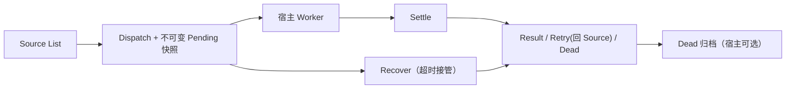

# EchoQueue

面向个人/中小项目的轻量 Redis 批处理 Go 库。以 Redis List 为输入输出载体、以 Lua 脚本完成批次原子边界，交付语义为 **At-Least-Once**：允许幂等重复，不允许静默丢失。

目标环境：**Redis 6.2+ standalone 或 replication primary**。不支持 Redis Cluster、Streams、服务化与外部配置中心。

## 目录

- [特性](#特性)
- [安装与依赖](#安装与依赖)
- [快速开始](#快速开始)
- [核心概念与数据流](#核心概念与数据流)
- [配置参考](#配置参考)
- [API 概览](#api-概览)
- [可靠性语义](#可靠性语义)
- [结果大小限制](#结果大小限制)
- [有界消费（宿主 Worker Pool）](#有界消费宿主-worker-pool)
- [Dead 可靠归档](#dead-可靠归档)
- [测试与验证](#测试与验证)
- [性能基线](#性能基线)
- [已知限制](#已知限制)
- [版本与升级](#版本与升级)
- [发布状态](#发布状态)

## 特性

- **Lua 原子闭环**：Dispatch、Settle、Recover 的关键竞态全部由 Redis Lua 原子脚本裁决，不使用 mock 或内存替代协议。
- **不可变 Pending 快照**：Dispatch 时固化批次配置与任务数据，不设置普通 TTL；Settle 不需要调用方重复路由信息。
- **Receipt 首终态栅栏**：第一个合法 Settle 或 Recover 获胜，其余请求按 `duplicate` / `conflict` / `stale` 分类。
- **结果大小硬限制**：超限结果在访问 Redis 之前被拒绝，不写 Effect、不写 Receipt、不删除 Pending/deadline、不做分片拆分。
- **宿主有界 Worker Pool 参考**：permit 先行、Worker/Buffer/in-flight 全硬上限、关闭与世代守卫，仅作宿主范式，不扩张核心 API。
- **Dead 可靠归档参考**：durable claim（BLMOVE）→ 外部幂等持久化 → 成功后 ACK 删除，崩溃窗口最多造成幂等重复。
- **真实 Redis 测试套件**：integration build tag 全量使用真实 Redis 6.2+，覆盖竞态、随机顺序、race 与故障窗口。

## 安装与依赖

```powershell
go get github.com/cccccccccooool/EchoQueue@v0.1.0
```

| 依赖 | 版本 |
| --- | --- |
| Go | 1.25+（go.mod 声明 `go 1.25.5`） |
| Redis | 6.2+ standalone 或 replication primary；`cluster_enabled=0` |
| go-redis | v9 |

## 快速开始

```go
import (
	"context"
	"encoding/json"
	"time"

	echoqueue "github.com/cccccccccooool/EchoQueue"
	"github.com/redis/go-redis/v9"
)

ctx := context.Background()
rdb := redis.NewClient(&redis.Options{Addr: "127.0.0.1:6379"})

cfg := echoqueue.DefaultConfig()
cfg.Namespace = "billing"
cfg.VisibilityTimeout = 30 * time.Second
cfg.ReceiptTTL = 24 * time.Hour
cfg.MaxRetry = 2

eq, err := echoqueue.New(rdb, cfg)
if err != nil {
	return err
}

queue, err := eq.Bind(echoqueue.QueueConfig{
	TaskName: "invoice",
	Source:   "billing:invoice:source",
	Result:   "billing:invoice:result",
	Dead:     "billing:invoice:dead",
})
if err != nil {
	return err
}

batch, err := queue.Dispatch(ctx, 1)
if err != nil {
	return err
}
if batch.ID != "" {
	receipt, err := eq.Settle(ctx, batch.ID, echoqueue.Outcome{
		RequestID: "worker-response-123",
		Results: []echoqueue.Result{{
			TaskID: batch.Tasks[0].TaskID,
			Data:   json.RawMessage(`{"ok":true}`),
		}},
	})
	_ = receipt
	_ = err
}
```

宿主负责把任务 JSON 写入 `QueueConfig.Source` List。任务应包含稳定的 `task_id`、`retry_count` 和 `payload`；没有 `task_id` 的原始 JSON 会在当前批次内生成稳定 ID。业务副作用必须按 TaskID 做幂等处理。

超时恢复由 Scheduler 生命周期负责：

```go
runCtx, stop := context.WithCancel(context.Background())
defer stop()
if err := eq.Run(runCtx); err != nil {
	// Redis 能力检查或 Recover 批次错误可在这里观察到。
	return err
}
```

`Run` 每轮最多处理 `RunBatchSize` 个 deadline 候选；Recover 失败后通过原子 Lua 操作把该候选的 deadline score 向后轮转，再继续同轮候选，不会用无界扫描掩盖坏批次。`defer` 只是恢复索引轮转，不是业务重试退避：它不修改 Pending、不修改任务的 `RetryCount`、不创建 Retry ZSet。宿主必须记录 `Run` 返回的错误，修复后重新启动 `Run`。

## 核心概念与数据流



| 概念 | Redis 载体 | 作用 |
| --- | --- | --- |
| Source | List（宿主提供） | 任务输入；Dispatch 从尾部消费 |
| Pending | String（不可变，无普通 TTL） | 批次事实快照：路由、MaxRetry、任务、时间戳 |
| Deadline | ZSET | 恢复索引，只作调度参考，不是事实来源 |
| Receipt | String（有限 PX TTL） | 终态栅栏与重复判定 |
| Result / Dead | List（宿主或内部默认） | 终态效果记录，含 TaskID 与 EffectID |
| DeadProcessing | List（归档器专用） | 领取后的 durable claim |

合法 Receipt、损坏 Receipt、孤儿 deadline（无 Pending 无 Receipt）和损坏 Pending 是不同状态：合法 Receipt 可原子清理残留 deadline；孤儿 deadline 可清理；损坏 Receipt 或损坏 Pending 必须保留证据。所有交付均为 At-Least-Once，业务副作用必须按 TaskID/effect_id 幂等。

## 配置参考

### Config（Scheduler 全局策略与安全上限）

| 字段 | 默认值 | 说明 |
| --- | --- | --- |
| `Namespace` | 必填 | 命名空间，用于内部 key 前缀（RawURL base64 编码） |
| `VisibilityTimeout` | 30s | 批次可见性超时；≥1ms |
| `ReceiptTTL` | 24h | 终态重复判定窗口；≥1ms。Pending 不设置普通 TTL |
| `MaxRetry` | 3 | 普通失败重试上限；`MaxRetrySet=true` 且 `MaxRetry=0` 表示明确不重试 |
| `MaxRetrySet` | true | 区分“显式 0”与“未指定” |
| `MaxBatchSize` | 1000 | 单次 Dispatch 最大任务数 |
| `MaxPayloadBytes` | 1 MiB | 单个任务 payload / 单个 `Result.Data` 最大原始 JSON 字节 |
| `MaxBatchBytes` | 64 MiB | 单批任务数据总量 / 单 Outcome Result 数据总量 |
| `RunInterval` | 500ms | Recover 轮询间隔 |
| `RunBatchSize` | 32 | 每轮 Recover 候选数 |

### QueueConfig（Bind 路由）

| 字段 | 必填 | 说明 |
| --- | --- | --- |
| `TaskName` | 是 | 队列唯一名，Bind 拒绝重复 |
| `Source` | 是 | 任务输入 List key |
| `Result` | 否 | 结果 List key；空则使用 namespace 内部默认 List |
| `Dead` | 否 | 死信 List key；空则使用 namespace 内部默认 List |

约定：

- 使用 `DefaultConfig()` 取得默认值，再修改 namespace、重试和安全上限。
- `MaxRetry=0` 必须同时设置 `MaxRetrySet=true`，以区别于“未指定、采用默认重试次数”。
- `Bind` 拒绝重复 TaskName，以及跨 Queue 或同一 Queue 内 Source/Result/Dead 的有效物理 Redis key 冲突。
- Bind 后修改调用方 `QueueConfig` 不影响已创建的不可变 Queue。

## API 概览

| 调用 | 签名 | 职责 |
| --- | --- | --- |
| `New` | `New(rdb *redis.Client, cfg Config) (*Scheduler, error)` | 构造 Scheduler，校验并归一化配置 |
| `Bind` | `(*Scheduler).Bind(QueueConfig) (*Queue, error)` | 绑定不可变队列句柄，检查路由冲突 |
| `Dispatch` | `(*Queue).Dispatch(ctx, batchSize int) (Batch, error)` | 原子消费 Source 并建立 Pending/deadline；空队列返回零 Batch |
| `Settle` | `(*Scheduler).Settle(ctx, batchID string, outcome Outcome) (Receipt, error)` | 结算批次；Outcome 必须覆盖每个 TaskID 恰好一次 |
| `Run` | `(*Scheduler).Run(ctx) error` | 恢复循环；同一实例同时只能有一个活动 Run |

## 可靠性语义

- Dispatch 原子保存不可变 Pending 快照，再移除 Source 任务。
- Settle 与 Recover 竞争同一个 Receipt 第一终态栅栏，第一个合法操作获胜。
- Receipt 状态：`applied`（本请求获胜）、`duplicate`（相同 request + 相同 command hash）、`conflict`（相同 request + 不同 hash）、`stale`（超时恢复后的迟到响应）、`not_found`、`not_due`、`invalid`。
- Result/Dead 记录包含 TaskID 与 EffectID，交付语义 At-Least-Once。
- Redis 能力检查按 Scheduler 缓存成功结果；首次失败不永久缓存，后续操作可重试。只接受 Redis 6.2+ 且 Cluster 未启用。
- 普通失败重试立即回到 Source，不提供 Retry ZSet、退避调度、quarantine、events、reconcile 或完整观测平台。

## 结果大小限制

Settle 在第一次访问 Redis 之前校验每个 `Result.Data` 的原始 JSON 字节数：

- 单个 `Result.Data` ≤ `MaxPayloadBytes`（含 JSON 空白，UTF-8 按字节计数）。
- 一个 Outcome 内全部 `Result.Data` 总字节 ≤ `MaxBatchBytes`（剩余预算累加，无整数溢出路径）。
- Failure 不参与预算（引用 Pending 中已受限的 payload）。
- 超限返回可识别错误（含 task_id、字节数与限制值，不含业务数据）；不执行 Lua、不写 Effect/Receipt、不删除 Pending/deadline。

大型业务数据必须存放在外部存储，Result 只携带引用、大小与校验 hash，例如：

```json
{"ref": "s3://bucket/key", "size": 42, "sha256": "..."}
```

## 有界消费（宿主 Worker Pool）

`examples/reliable_consumer/` 是可编译的宿主参考程序，演示如何用现有公开 API 构造有界消费与 Dead 归档，不扩张 EchoQueue 核心 API 或 Config。Worker 调用顺序必须固定：

```text
Acquire worker permit
  -> Dispatch
  -> Handle
  -> Settle
  -> Release permit
```

- permit 与 buffer slot 在 Dispatch 之前取得：Pool 满时停止 Dispatch，任务留在 Source；已 Dispatch 批次总能立即进入有界通道。
- Worker、Buffer、in-flight 批次全部硬上限；慢 Handler 形成背压而非无界预取。
- Dispatch 后进程退出：批次已有 Pending/deadline，由 Recover 接管；Pool 只是背压与短期缓冲，不是可靠状态来源。
- 关闭：context 取消后停止新 Dispatch；ShutdownGrace 内完成 in-flight，超时后剩余批次连同容量归还、交由 Recover。世代守卫保证旧世代 worker 不结算批次。
- Handler 必须响应 context 取消；忽略取消的 handler 会在 Run 返回后残留，其批次由 Recover 接管。

```powershell
go run ./examples/reliable_consumer -addr 127.0.0.1:6379
```

## Dead 可靠归档

归档协议固定为“领取 → 幂等持久化 → 成功后 ACK”：

```text
取得 Buffer 空位
  -> BLMOVE Dead DeadProcessing LEFT RIGHT（durable claim）
  -> 有界批次聚合（BatchSize 硬上限）
  -> 外部 Sink 按 effect_id 幂等持久化
  -> 明确成功后 LREM DeadProcessing 1 rawRecord
  -> 释放容量
```

- `DeadProcessing` 是领取后的 durable claim；外部持久化成功之前严禁 ACK 删除。
- Sink 失败、结果不确定或进程退出时记录保留在 DeadProcessing；重启后单活动归档器重放处理。
- persist 成功但 ACK 前崩溃会产生重复持久化调用，外部 Sink 必须以 `effect_id` 为幂等键去重。
- 损坏 JSON 或缺失/错误类型 `effect_id` 的记录保留并报错，不转 quarantine、不自动删除；连续损坏洪峰受 BatchSize 上限约束，不无界预取。
- 启动恢复按固定窗口分页读取遗留 DeadProcessing，Go 内存有界。
- 初版只允许一个活动归档器，不实现分布式归档锁；只处理显式配置的 Dead List，不扩张到 Result 或 Retry。

参考程序默认**不启动**归档器；显式启用时使用仅演示的日志 Sink（返回错误、永不删除记录）：

```powershell
go run ./examples/reliable_consumer -enable-archive -addr 127.0.0.1:6379
```

生产环境必须提供自己的幂等 `DeadSink`（数据库、对象存储或文件系统），再启用归档。

## 测试与验证

默认单元测试不依赖 Redis：

```powershell
go test ./... -count=1
go vet ./...
go mod verify
```

真实 Redis integration（Redis 6.2+，`127.0.0.1:6380` 为本地测试容器约定）：

```powershell
$env:ECHOQUEUE_REDIS_ADDR = "127.0.0.1:6380"
go test -tags=integration ./... -count=1
go test -tags=integration ./... -shuffle=on -count=5
$env:GOARCH = "amd64"; $env:CGO_ENABLED = "1"
go test -race -tags=integration ./... -count=1
```

- `integration` build tag 必须连接真实 Redis；测试不使用 mock、miniredis 或源码路径加载替代 Lua 与竞态路径。
- 每个测试使用唯一 namespace/key 前缀，只清理自身数据，不使用 `FLUSHDB`。
- 测试不依赖执行顺序（`-shuffle=on` 验证）。
- 覆盖率基线：根包单元 58.5%，带 integration 82.6%。

## 性能基线

性能脚本位于 `scripts/run-performance.ps1`，只使用唯一 namespace 与宿主 List，结束后只清理本轮数据，不执行 `FLUSHDB`：

```powershell
./scripts/run-performance.ps1 -RedisAddress 127.0.0.1:6380
```

默认基线包含连续消费、预灌后间隔消费，以及 1x/4x/8x 并发生产与消费压力场景。最近一次本地 Redis 基线处理 72,000 个逻辑任务、73,440 次投递尝试，连续消费约 13,948/s，20ms 间隔消费约 3,759/s，8x 压力消费约 18,958/s；Result 唯一任务数 72,000，Dead 0，Source 余量 0。追加的 8x/16x/32x 边界观察在 32x 时约 21,575/s，仍未出现错误，但这只是当前机器的观测上限，不是系统极限。

压测会在每个逻辑任务首次投递时按默认 2% 注入一次可恢复失败，用于验证重试链路；最近基线的整体重试率为 2.00%，重试投递率为 1.96%，丢失率为 0.0000%。这里的丢失率定义为最终未出现在唯一 Result 或 Dead 记录中的逻辑任务比例。该吞吐是当前本机 Docker Redis 的可复现实验基线，不是生产容量承诺；交付语义仍是 At-Least-Once，不是 Exactly Once。

独立验收补充（2026-08-09，Redis 8.8.0 本机容器）：`scripts/perf_harness` 在 150,000 逻辑任务（5 场景、2% 重试注入、batch 64）下唯一 Result 150,000、Dead 0、丢失率 0.0000%，8 并发消费吞吐约 18,359/s；20,000 任务延迟压测中 Dispatch P95 约 8.8ms、Settle P95 约 15.1ms。

## 已知限制

- 交付语义为 At-Least-Once：业务副作用必须按 TaskID/effect_id 幂等，不允许 Exactly Once 假设。
- 不提供 Retry ZSet、指数退避、quarantine、events、reconcile 或完整观测平台；普通失败立即回 Source。
- 不提供 YAML 主配置、V1/V2 双轨、复杂迁移、服务化、Web UI 或多租户。
- Redis OOM 或进程硬杀不保证跨系统完整回滚；必须监控容量并设置外部背压。
- 大型结果不拆分：必须使用外部存储引用。
- Dead 归档器初版为单活动实例，无分布式锁。

## 版本与升级

- `v0.x` 期间公开 API 和 Redis 数据协议仍可能随次版本调整，调用方应固定具体版本。
- 当前 Redis 数据协议版本为 `1`。升级前应停止旧消费者并排空 Pending，或保留旧数据与 keyspace 以便回滚。
- 回滚版本必须能够识别现有协议；不要仅回滚 Go 代码而忽略 Redis 中尚未完成的 Pending、Receipt 和 deadline。
- 已推送的版本 Tag 不移动、不覆盖；修复使用新的 SemVer 版本。

## 发布状态

当前发布版本为 `v0.1.0`，module path 为 `github.com/cccccccccooool/EchoQueue`。本仓库按个人私用库维护，不提供公共兼容性承诺。
